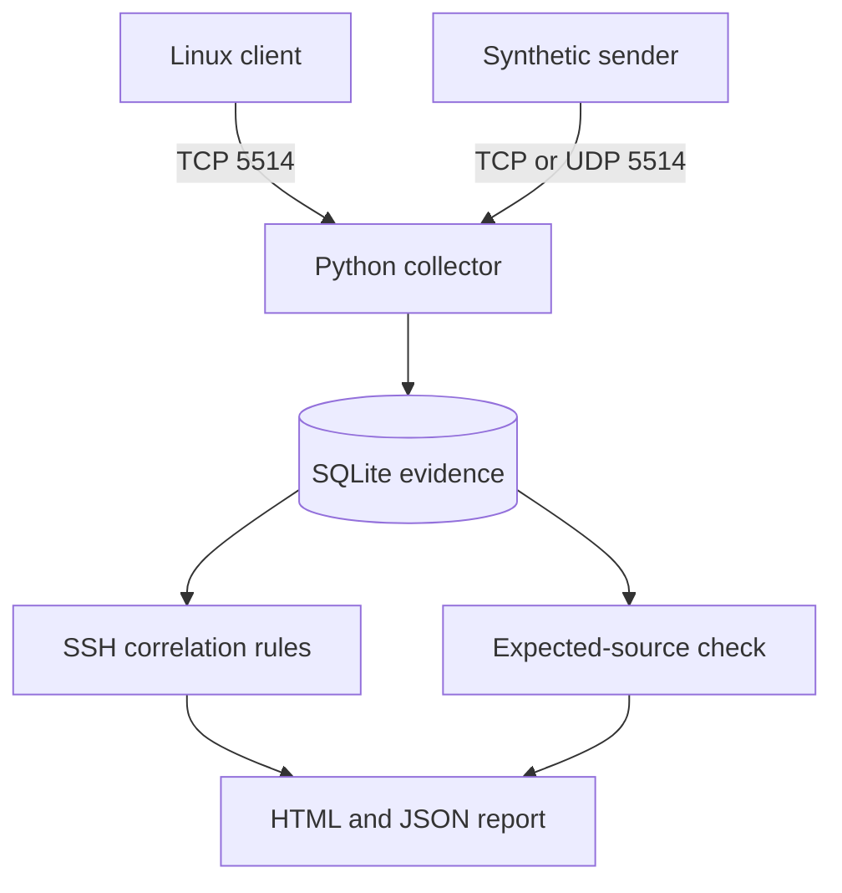

# Syslog Sentinel

**A centralized syslog collection and detection lab by CyberBlocker.**

Collect TCP and UDP syslog, preserve evidence in SQLite, detect suspicious SSH sequences, and identify expected devices that have gone quiet. Generate a searchable offline HTML report and JSON summary.

Educational Python project. No third-party Python packages. Python 3.10+ required; Docker optional. Bundled demo activity is synthetic. This is not a production SIEM.

## Architecture



## Quick start

Extract the project and open a terminal in this folder. Use a desktop, laptop, or VM. On macOS/Linux use `python3` if `python` is unavailable. On Windows you may use `py` instead.

In terminal 1:

```bash
python sentinel.py collect
```

Leave it running. Open terminal 2 in the same folder:

```bash
python sentinel.py demo
python sentinel.py report
```

Double-click `reports/report.html`. On a fresh database expect **9 events, 2 reported hosts, 2 SSH findings, and db-01 marked never seen**. web-01 and fw-01 should be recent if you generate the report within 120 seconds. The sender's confirmation alone is not proof of receipt; verify the report count.

To try UDP, run `python sentinel.py demo --transport udp`, then regenerate the report. This adds nine more events if all UDP packets arrive. Reset the database for a clean demo.

The report is an offline snapshot with a text filter, not a live dashboard. It analyzes all stored events and shows the last 200 in the evidence table. A sample from a synthetic network run is included at `examples/report.html`.

## Standout feature: expected-source health

A lack of alerts does not prove that the environment is healthy. `inventory.json` lists devices you expect to hear from. Each is classified as **recent**, **silent**, or **never seen** when you generate the report. The demo deliberately omits db-01.

This measures collection activity, not machine uptime. Idle devices may legitimately send nothing. Add scheduled client heartbeats for a more realistic exercise. Reported hostnames are not authenticated identities.

## Detection logic

| Rule | Trigger | Meaning |
|---|---|---|
| SSH-001 | Five SSH failures in 60 seconds | Possible password guessing |
| SSH-002 | Accepted login after at least five matching failures in the preceding 60 seconds | Higher-priority analyst review |

Correlation keys: reported hostname, username, and source IP in the message. Only `sshd` or `sshd[PID]` messages participate. Windows use collector receipt time. SSH-001 fires when the active window reaches five failures. SSH-002 clears that key's window after a match. Reports recalculate historical findings; this is not an alert notification service. The firewall event is searchable evidence, not a separate rule.

## Guides

- [Detailed setup and troubleshooting](SETUP.md)
- [GitHub publishing and screenshot checklist](GITHUB.md)
- [Investigation exercise](INVESTIGATION.md)
- [Validation record](VALIDATION.md)

## Tests

```bash
python -m unittest discover -s tests -v
```

Tests cover network ingestion, split TCP frames, detection boundaries, host/user isolation, source health, persistence, malformed input, and HTML escaping. GitHub Actions also builds the optional Docker image.

## Supported input and limitations

- IPv4 TCP/UDP; default bind is localhost port 5514.
- TCP accepts newline-delimited and octet-counted frames, maximum 65,535 bytes. Idle connections close after 10 seconds; clients must reconnect.
- Parses RFC 5424 version 1 **with NIL structured data (`-`)** and a common RFC 3164-style format. This is a subset, not full RFC compliance.
- Unsupported formats are stored with `parsed=false`, peer IP, and raw decoded text; no SSH detection is applied to them.
- Sender timestamps are preserved separately from receipt time. Invalid UTF-8 is replaced, so raw text is not a byte-for-byte forensic archive.
- No TLS, sender authentication, retention automation, connection cap, rate limiting, or production availability guarantees. TCP is not a durable application acknowledgment. UDP can lose events.
- SQLite grows until reset; reports load the full dataset into memory. Use small, trusted labs. Never expose this listener to the public internet.

## Skills demonstrated

Network logging, Python sockets, syslog priorities, SQL storage, time-window correlation, evidence handling, collection coverage, automated testing, and technical documentation.

## Future work

Add a second VM and scheduled heartbeats; implement structured-data parsing; add retention and date filtering; place TLS-capable rsyslog in front; measure TCP/UDP behavior under controlled packet loss.

## References

- [RFC 5424: syslog message format](https://www.rfc-editor.org/rfc/rfc5424)
- [RFC 6587: TCP framing](https://www.rfc-editor.org/rfc/rfc6587)
- [rsyslog forwarding module](https://docs.rsyslog.com/doc/configuration/modules/omfwd.html)
- [Docker Compose quickstart](https://docs.docker.com/compose/gettingstarted/)

MIT license.
